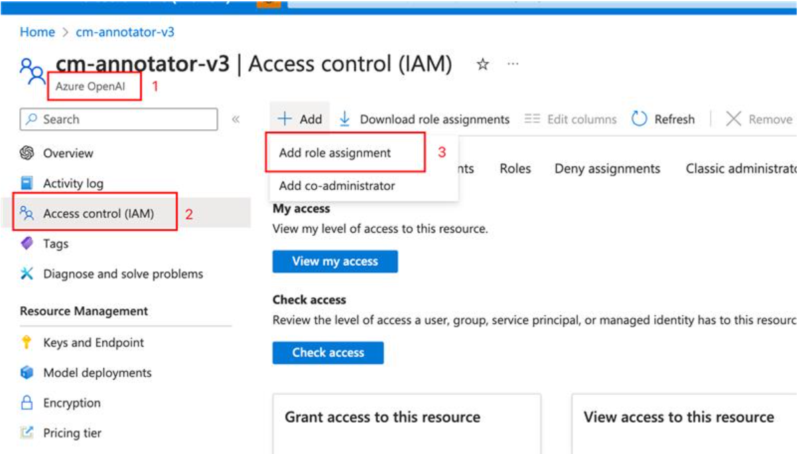
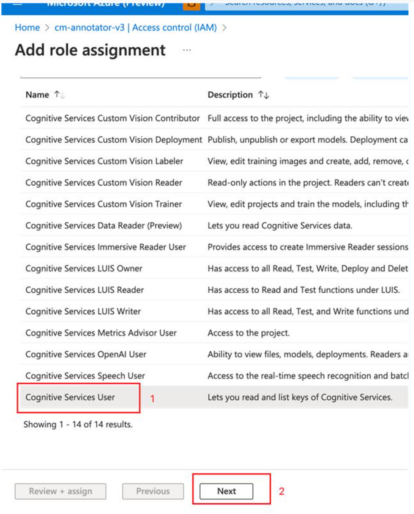
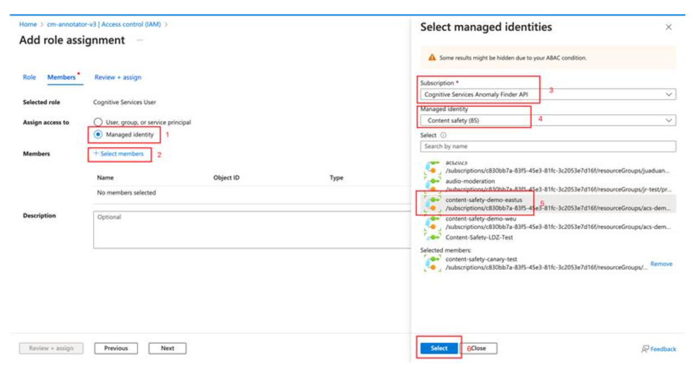
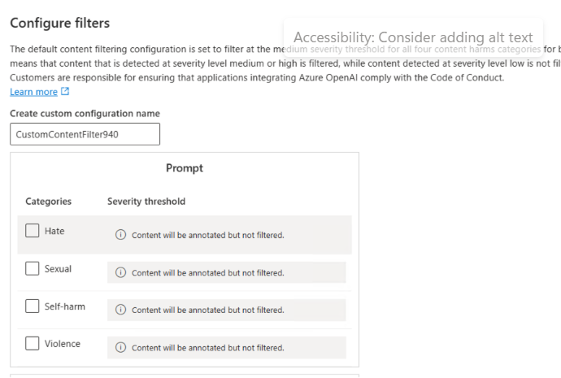

# Auto Reviewer API Gated Preview Documentation  

With the extensive capabilities of natural language understanding, it's been proven that LLM reaches human parity in understanding the harmful content policy/community guideline and performing harmful content review task that is adaptive to each customer's use case.  

Alongside the practice of enforcing content safety techniques in products/communities in various industries, it's been found the "definition of harmful content" varies by use cases. However, the categories of Azure AI Content Safety is defined without knowing the customers' specific community guidelines/use cases. Thus, it's been a common practice to perform an additional human review process after the content gets flagged by Azure AI Content Safety API according to each customer's community guideline/ use case. Eventually to make the final judgement of getting the content blocked or not. By introducing the review process, it can ensure the results to be adapted to each customer's use case, but purely relying on human reviewers is not scalable and also introduces significant delay.
The Auto Reviewer API just helps to augment human review process to make it more scalable and more efficient, but also keeps on-parallel accuracy with human beings.

## ⚠️ Disclaimer

The sample code could have offensive content, user discretion is advised.

## 📒 Overview

- **How It Works** contains instructions for using the service in more general ways.
- **Concepts** provides in-depth explanations of the service categories.
- **Sample Code** shows sample requests using the cURL, Python, C# and Java.
- **QuickStart** goes over getting-started instructions to guide you through making requests to the service.

## 🔎How It Works

- ### Step 1: Create an auto reviewer

After the content is flagged by 'Analyze' API of Azure AI Content Safety on a certain harmful category, if customers would like to get a more granular label aligning with their specifc community guidelines/ use cases, the very first step is to create an auto reviewer. Customers need to provide two key materials to train an auto reviewer, which is very similar to train a human reviewer:

- **Guideline definition**: A detailed description of the review task, which can include multiple labels under a certain category. For example, there can be multiple sub-labels under "Violence", like "Terrorism", "Weapons", "Bullying"..., you need to provide a description for each of the label provided. **Note** that there will always be a "Others" label to classify cases which do not fall in any defined labels.
- **Samples**: Samples play a critical role to train LLM to better understand the label definition in real cases. Provide a balanced dataset with both positive and negative(optional) examples, which should try best to be representative. Get the samples stored in a Blob Storage, and input the URL.

When you get the materials ready, call the "PUT" auto reviewers API to create an auto reviewer, it will take a couple of minutes to create. Use the “GET” auto reviewers API to get the creation status.

- ### Step 2: Review labeled content using created reviewers

Call the "AutoReview" API, specify the "AutoReviewerName" and "AutoReviewerVersion" to be used and the content to be reviewed to perform the automated review. Eventually, you will be able to get a more granular label to help make the final blocking/non-blocking decision and align with specific community guidelines/use cases.

- ### Language availability

Currently, this API is only available in English. While users can try guidelines in other languages, we don't commit the output (like the languages of reasoning). We output the reasoning in the language of provided guidelines by default. New languages will be supported in the future.

## 🗃Concepts

### Community guideline

Community guidelines refer to a set of rules or standards that are established by an online community or social media platform to govern the behavior of its users. These guidelines are designed to ensure that all users are treated with respect, and that harmful or offensive content is not posted or shared. They may include rules around hate speech, harassment, nudity, violence, or other types of content that may be deemed inappropriate. Users who violate community guidelines may face consequences such as having their account suspended or banned.

### Category

A category refers to a group of prohibited content or behavior that is outlined in the guidelines. Categories may refer to things like hate speech, violence, sexual or other forms of prohibited content. These categories are typically defined in broad terms to encompass a range of different behaviors and types of content that are considered to be problematic. Each category may contain more granular "labels", which can vary according to different business types or use cases. For example, in the community guideline of a shooting game, talking about weapons is acceptable, which needs to be reflected in the community guideline. By outlining specific categories of prohibited content, community guidelines provide users with a clear understanding of what is and is not allowed on the platform, and help to create a safer and more positive online community.

### Label

A label can be considered as a more granular review unit within a category, by clearly defining the label, auto reviewer would be able to perform the review of labeled content on a certain category to make it more specific, adaptive to each customer's use case. Eventually empowers the final decision-making of blocking/non-blocking.

## 💡 QuickStart - Perform auto review by using the API

Before you can begin to test, you need to [create an Azure AI Content Safety resource]((https://aka.ms/acs-create)) and get the subscription keys to access the resource.

> ###  📘 NOTE
>
> The samples could contain offensive content, user discretion is advised!!

### Prerequisites

#### 1. Whitelist your subscription ID

1. Submit this form by filling in your subscription ID to whitelist this feature to you: [Microsoft Forms](https://forms.office.com/r/38GYZwLC0u).
2. The whitelist will take up to 48 hours to approve. Once you receive a notification from Microsoft, you can go to the next step.

#### 2. Create an Azure Content Safety resource

1. Sign in to the [Azure Portal](https://portal.azure.com/).
2. [Create Content Safety Resource](https://aka.ms/acs-create). Enter a unique name for your resource, select the **whitelisted subscription**, resource group, and your preferred region in one of the **East US, Sweden Central** and pricing tier. Select **Create**.
3. **The resource will take a few minutes to deploy.** After it does, go to the new resource. To access your Content Safety resource, you'll need a subscription key; In the left pane, under **Resource Management**, select **API Keys and Endpoints**. Copy one of the subscription key values and endpoint for later use.

> ###  📘 NOTE
>
> Currently the gated preview features are only available in two regions:  **East US, Sweden Central**. Please create your Content Safety resource in these regions. Feel free to let us know your future production regions so we can plan accordingly.
>

#### 3. Bring your own Azure OpenAI resource

In gated preview stage, you need to bring your own Azure OpenAI resource to perform the auto review task. Please make sure your deployment is built on GPT-4, for other model versions the review quality is not guaranteed.

**Grant your Azure Content Safety resource access to your Azure OpenAI resource**

1. Go to your Azure OpenAI resource and open 'Access control'. Click 'Add role assignment'.


2. Search for role 'Cognitive Services User', click, and select 'Next'.


3. Choose 'Managed Identity' for 'assign access to' option, and choose the Azure Content Safety resource that you've created in 'Members'.


4. Finally select 'Review + assign'. After it is completed, your Azure Content Safety resource has been assigned permission to use your Azure OpenAI resource for review task.

**Get your Azure OpenAI resource endpoint**

Go to your Azure OpenAI resource and open 'Keys and endpoint' to copy the endpoint.

**Get your GPT-4 deployment name**

Go to your Azure OpenAI resource and open 'Model deployments'. Select 'Manage Deployments', and get the deployment name of GPT-4 that you'd like to use for review task.

**Modify content filtering setting to enable 'annotation' mode**

The Auto Reviewer API needs to leverage the extended language understanding capability of GPT-4 for content annotation task, which may contain harmful content. To complete the task and not get the input/output filtered, the content filtering configuration in your GPT-4 deployment needs to be updated to 'annotation' mode. You may need to apply for modifying content filtering by filling [this form](https://customervoice.microsoft.com/Pages/ResponsePage.aspx?id=v4j5cvGGr0GRqy180BHbR7en2Ais5pxKtso_Pz4b1_xUMlBQNkZMR0lFRldORTdVQzQ0TEI5Q1ExOSQlQCN0PWcu). After the application is approved, you can update the content filtering configuration in your GPT-4 deployment to 'annotation' mode by unchecking the boxes at each harmful category.


[**Note**] After completing the above steps, please send the following information to <contentsafetysupport@microsoft.com>:

- Subscription ID
- Azure AI Content Safety resource ID
- Azure OpenAI resource endpoint
- GPT-4 deployment name

### Test with sample request

Now that you have a resource available in Azure for Content Safety and you have a subscription key for that resource, let's run some tests by using the Auto Reviewer API!

#### 1. Create an auto reviewer according to specific community guideline

The initial step is to convert your customized community guideline/content policy to one or multiple auto reviewers in Azure AI Content Safety. Then get it ready to be used for the following review task.

| Name                   | Description                                                  | Type    |
| :--------------------- | :----------------------------------------------------------- | ------- |
| **AutoReviewerName** | (Required) Auto reviewer name should start with "Customized_", valid character set is "0-9A-Za-z._~-" | String  |
| **Labels** | (Required) An array to define the labels within each auto reviewer as the minimum review unit. The max label count is 10, min label count is 2. Within each label, you need to specify a name(string) and a description(string) to better describe the scope of the label. When performing review, if your input does not belong to any defined labels, we will output a predefined label with name="Others". | List  |
| **ExampleBlobUrl**   | (Optional) The file should  be ".jsonl" format, where each line is an example in json format, the maximum file size is 1MB in priviate preview.  | String    |
| **blobDelimiter** | (Optional) Delimiter of blob url. If not provided, '/' will be used as the delimiter to parse the exampleBlobUrl.|

**Request payload reference**

```
{
  "AutoReviewerName": "Customized_AD0za6RSTFm5pqZzWD2aBrjYTckws",//required, Auto reviewer name should start with "Customized_", valid character set is "0-9A-Za-z._~-". The maximum length is 64 Unicode characters.
  "Labels": [//required, the max label count is 10, min label count is 2. 
    {
      "labelname": "name_0" //required, label name
      "description": "string" //required, to enumerate the detailed definitions of the label here.
    },
    {
      "labelname": "name_1" //required, label name
      "description": "string" //required, to enumerate the detailed definitions of the label here.
    },
  ],
  "exampleBlobUrl": "string",//optional, the file should  be ".jsonl" format, where each line is an example in json format, the maximum file size is 1MB in gated preview.
  "blobDelimiter": "string",
  "status": "NotStarted"
}
```

**Format requirement for examples**

The examples that are provided for each label in the Blob URL need to follow below format requirements:

```
{
  "text": "The text of the example 1", //required, 
  "id": 0, //required, the label id that the example describes,
  "reasoning": "The reason for the review result" //optional
}
{
  "text": "The text of the example 2", //required, 
  "id": 1, //required, the label id that the example describes
  "reasoning": "The reason for the review result" //optional
}
```

**Sample Code**

- Curl

```
curl --location --request PUT 'https://<endpoint>/contentsafety/text/autoReviewers/AnimalAbuse?api-version=2024-02-15-preview' \
--header 'Ocp-Apim-Subscription-Key: <api_key>' \
--header 'Content-Type: application/json' \
--data '{
  "autoReviewerName": "AnimalAbuse",
  "labels": [
    {
      "labelName": "Other",
      "description": "all cases that do not fall into sub-category 1"
    },
    {
      "labelName": "AnimalAbuse",
      "description": "Animal abuse, or animal cruelty is the crime of inflicting physical pain, suffering or death on an animal, usually a tame one, beyond necessity for normal discipline. It can include neglect that is so monstrous (withholding food and water) that the animal has suffered, died or been put in imminent danger of death."
    }
  ],
  "exampleBlobUrl": "",
  "blobDelimiter": ""
}'
```

- Python

```
import requests
import json

endpoint = "<endpoint>"
url = endpoint+"/contentsafety/text/autoReviewers/AnimalAbuse?api-version=2024-02-15-preview"

headers = {
  "Ocp-Apim-Subscription-Key": '<api_key>',
  "Content-Type": "application/json"
}
payload = json.dumps({
  "autoReviewerName": "AnimalAbuse",
  "labels": [
    {
      "labelName": "Other",
      "description": "all cases that do not fall into sub-category 1"
    },
    {
      "labelName": "AnimalAbuse",
      "description": "Animal abuse, or animal cruelty is the crime of inflicting physical pain, suffering or death on an animal, usually a tame one, beyond necessity for normal discipline. It can include neglect that is so monstrous (withholding food and water) that the animal has suffered, died or been put in imminent danger of death."
    }
  ],
  "exampleBlobUrl": "",
  "blobDelimiter": ""
})

response = requests.request("PUT", url, headers=headers, data=payload)

print(response.status_code)
print(response.text)
```

#### 2. Perform review on labeled text

After the auto reviewer is created successfully, you can provide the labeled text to be further reviewed by the newly created auto reviewer. The input is very simple of 'text', 'autoReviewerName' and "autoReviewerVersion".

| Name                   | Description                                                  | Type    |
| :--------------------- | :----------------------------------------------------------- | ------- |
| **AutoReviewerName** | (Required) Name of the newly created auto reviewer. | String  |
| **Text** | (Required) String of the text to be reviewed. The maximum length is 1000 Unicode characters. | String |
|**AutoReviewerVersion**| The version of the auto reviewer. If not assigned we will use the latest version. | String |

**Request payload reference**

```
{
  "text": "string",
  "autoReviewerName": "string",
  "autoReviewerVersion": 0
}

```

**Sample Code**

- Curl

```
curl --location 'https://<endpoint>/contentsafety/text:autoReview?api-version=2024-02-15-preview' \
--header 'Ocp-Apim-Subscription-Key: <api_key>' \
--header 'Content-Type: application/json' \
--data '{
  "text": "I want to kill a cat",
  "autoReviewerName": "AnimalAbuse",
  "autoReviewerVersion": 1
}'
```

- Python

```
import requests
import json

endpoint = "<endpoint>"
url = endpoint+"/contentsafety/text:autoReview?api-version=2024-02-15-preview"

headers = {
  "Ocp-Apim-Subscription-Key": '<api_key>',
  "Content-Type": "application/json"
}
payload = json.dumps({
  "text": "I want to kill a cat",
  "autoReviewerName": "AnimalAbuse",
  "autoReviewerVersion": 1
})

response = requests.request("POST", url, headers=headers, data=payload)

print(response.status_code)
print(response.text)
```

## Other Auto Reviewer APIs

### Get operation status of creating Auto Reviewer version

**Sample Code**

-Curl

```
curl --location 'https://<endpoint>/contentsafety/text/autoReviewers/operations/<operation-id>?api-version=2024-02-15-preview' \
--header 'Ocp-Apim-Subscription-Key: <api_key>'
```

-Python

```
import requests
import json

endpoint = "<endpoint>"
url = endpoint+"/contentsafety/text/autoReviewers/operations/<operation-id>?api-version=2024-02-15-preview"

headers = {
  "Ocp-Apim-Subscription-Key": '<api_key>',
  "Content-Type": "application/json"
}

response = requests.request("GET", url, headers=headers, data=payload)

print(response.status_code)
print(response.text)
```

### Get a specific Auto Reviewer version

**Sample Code**

-Curl

```
curl --location 'https://<endpoint>/contentsafety/text/autoReviewers/AnimalAbuse?api-version=2024-02-15-preview&version=1' \
--header 'Ocp-Apim-Subscription-Key: <api_key>'
```

-Python

```
import requests
import json

endpoint = "https://<endpoint>"
url = endpoint+"/contentsafety/text/autoReviewers/AnimalAbuse?api-version=2024-02-15-preview&version=1"

headers = {
  "Ocp-Apim-Subscription-Key": '<api_key>',
  "Content-Type": "application/json"
}

response = requests.request("GET", url, headers=headers, data=payload)

print(response.status_code)
print(response.text)
```

### List Auto Reviewers

**Sample Code**

-Curl

```
curl --location 'https://<endpoint>/contentsafety/text/autoReviewers?api-version=2024-02-15-preview' \
--header 'Ocp-Apim-Subscription-Key: <api_key>'
```

-Python

```
import requests
import json

endpoint = "https://<endpoint>"
url = endpoint+"/contentsafety/text/autoReviewers?api-version=2024-02-15-preview"

headers = {
  "Ocp-Apim-Subscription-Key": '<api_key>',
  "Content-Type": "application/json"
}

response = requests.request("GET", url, headers=headers, data=payload)

print(response.status_code)
print(response.text)
```

### Delete a specific Auto Reviewer version

**Sample Code**

-Curl

```
curl --location --request DELETE 'https://<endpoint>/contentsafety/text/autoReviewers/AnimalAbuse?api-version=2024-02-15-preview&version=2' \
--header 'Ocp-Apim-Subscription-Key: <api_key>'
```

-Python

```
import requests
import json

endpoint = "https://<endpoint>"
url = endpoint+"/contentsafety/text/autoReviewers/AnimalAbuse?api-version=2024-02-15-preview&version=1"

headers = {
  "Ocp-Apim-Subscription-Key": '<api_key>',
  "Content-Type": "application/json"
}

response = requests.request("DELETE", url, headers=headers, data=payload)

print(response.status_code)
print(response.text)
```

## 📒 Key Reference

- [Content Safety Doc](https://aka.ms/acs-doc)

## 💬 We're here to help

If you get stuck, [shoot us an email](mailto:acm-team@microsoft.com) or use the feedback widget on the upper right of any page.

We're excited you're here!
